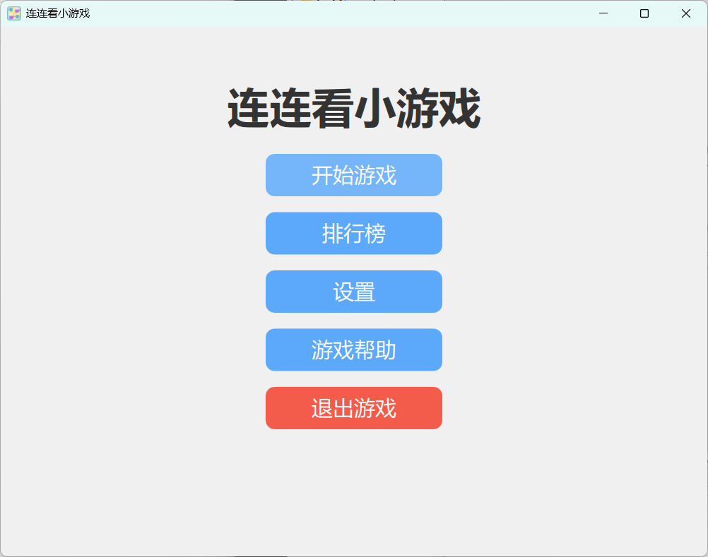
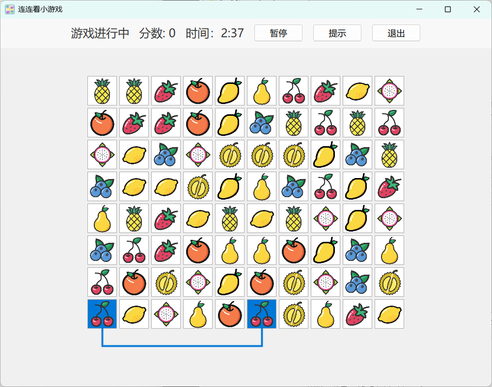

# Qt 和 Cpp 的连连看

[](https://opensource.org/licenses/MIT)

## 项目简介

用 Qt(QML) 和 C++ 编写的连连看小游戏，这是数据结构课程的实践作业。游戏具有多种难度级别、排行榜系统和多语言支持。

> 镜像仓库：[gitcode.com/sakurakugu/LinkGame](https://github.com/sakurakugu/LinkGame)




## 功能特点

- 经典连连看玩法，消除相同水果图案
- 三种难度级别：简单、普通、困难
- 支持自定义游戏参数
- 计时和计分系统
- 排行榜记录
- 多语言支持（中文、英文、日文）
- 主题切换
- 音效支持

## 技术栈

- C++
- Qt 6.9.1
- QML
- CMake 构建系统
- toml11（配置文件解析）

## 项目结构

- `cpp/` - C++源代码，包含游戏逻辑和配置
- `qml/` - QML 界面文件
- `i18n/` - 国际化翻译文件
- `image/` - 图像资源
- `music/` - 音效资源
- `build/` - 构建输出目录

## 构建与运行

### 前提条件

- Qt 6.9.1 或更高版本
- CMake 3.16 或更高版本
- 支持 C++23 的编译器

### 构建步骤

> 如果构建失败，大概率是网络问题，请先删除 `_deps/` 然后从 github 上下载 [toml 库](https://github.com/ToruNiina/toml11) 的源代码 放到 `_deps/toml11-src` , 然后若还是错误，请删除 `_deps/toml11-subbuild` 目录并重新执行构建步骤即可

#### 使用 Qt Creator 构建

1. 克隆项目到本地

   ```bash
   git clone https://gitcode.com/sakurakugu/LinkGame.git
   cd LinkGame
   ```

2. 使用 Qt Creator 打开并构建项目
   - 打开 Qt Creator
   - 选择 `文件` -> `打开文件或项目`
   - 选择 `CMakeLists.txt` 文件
   - 选择 `构建` -> `构建`
   - 选择 `运行` -> `运行`

#### 使用 CMake 构建

1. 克隆项目到本地

   ```bash
   git clone https://gitcode.com/sakurakugu/LinkGame.git
   cd LinkGame
   ```

2. 配置 VSCode

   - 在 VSCode 中，下载 Qt Extension Pack 和 CMake Tools 插件
   - 其次在插件设置中设置 Qt 路径
   - 然后按下 `Ctrl+Shift+P` 打开命令面板，输入 `CMake: Select a Kit` 并选择 `Qt-6.8.3-mingw_64`
   - 最后在终端中输入以下命令

   ```bash
   mkdir build
   cd build
   cmake ..
   ```

3. 构建项目

   - 按下 `Ctrl+Shift+P` 打开命令面板，输入 `CMake: Build Target` 按钮
   - 选择 `all` 选项
   - 等待构建完成

4. 运行游戏
   ```bash
   cd ./build
   ./appLinkGame
   ```

## 多语言支持

本游戏支持多种语言，包括中文、英文和日文。若要更新或添加新的翻译：

1. 生成翻译文件

   在这里添加所需的翻译文件路径和语言列表到 `CMakeLists.txt` 文件中：

   ```cmake
   # 设置国际化翻译的语言列表
   set(QT_I18N_TRANSLATED_LANGUAGES 
      en
      zh_CN
      ja
   )
   # 设置国际化翻译文件的路径
   set(I18N_FILES
      i18n/LinkGame_en.ts
      i18n/LinkGame_zh_CN.ts
      i18n/LinkGame_ja.ts
   )
   ```

   然后运行CMake以生成待翻译文件：

   ```bash
   cmake -B build -S . # 设置构建目录并生成翻译文件
   cmake --build build --target update_translations # 更新翻译文件
   cmake --build build --target all # 构建并生成可执行文件
   ```

   > 如果没找到命令，记得将 `C:\安装位置\Qt\6.9.1\mingw_64\bin` 放入环境变量中

2. 使用 Qt Linguist 打开 `i18n/LinkGame_*.ts` 文件进行翻译编辑

3. 重新构建项目，翻译会自动被编译并添加到项目中

## 游戏玩法

1. 选择游戏难度（简单、普通或困难）或自定义游戏参数
2. 点击两个相同的图案，如果它们可以通过不超过两个弯折的连线相连，则会被消除
3. 消除所有图案即可获胜
4. 如果无法继续消除，可以使用"重排"功能

## 使用到的库

- [水果图标](https://www.iconfont.cn/search/index?searchType=icon&q=%E6%B0%B4%E6%9E%9C)
- [Qt](https://www.qt.io/)
- [toml11](https://github.com/ToruNiina/toml11) 库用于配置文件解析

## 其他


