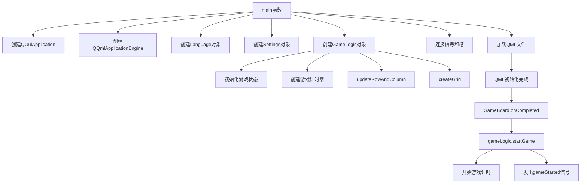
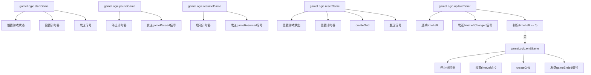
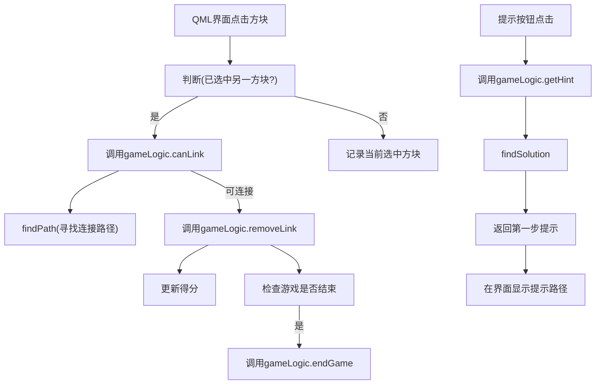
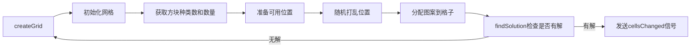
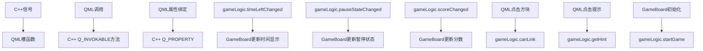

# 连连看游戏设计与实现

## 1. 游戏核心逻辑（GameLogic）

### 1) 游戏地图生成与管理
- 创建游戏网格，按照设置生成随机的方块图案
- 确保每次生成的网格都有可行解
- 维护方块状态，包括显示、消除等操作

### 2) 路径连接算法
- 使用BFS算法检测两个方块是否可以连接
- 支持最多两个转折点的连接路径查找
- 构建并返回连接路径的点序列，用于界面显示连线动画

### 3) 游戏状态管理
- 控制游戏的开始、暂停、恢复和结束
- 管理游戏计时器，实现倒计时功能
- 维护游戏得分，并在消除方块时更新分数

### 4) 提示系统
- 自动查找当前局面中可连接的方块对
- 生成完整的解决方案步骤列表
- 提供单步提示功能，帮助玩家找到可连接的方块

## 2. 设置管理（Settings）

### 1) 游戏配置管理
- 管理玩家名称、难度、游戏时间等游戏参数
- 提供方法设置和获取各种游戏设置
- 发出设置变化的信号，通知其他组件更新

### 2) 排行榜功能
- 维护玩家成绩记录，按难度和分数排序
- 支持添加新分数到排行榜
- 提供查询排名功能

### 3) 界面设置
- 管理窗口尺寸、全屏模式等界面相关设置
- 控制方块数量和种类，影响游戏难度
- 管理音量和声音状态设置

## 3. 配置系统（Config）

### 1) 配置文件读写
- 负责从TOML格式的配置文件中读取游戏配置
- 将游戏设置保存到配置文件
- 提供配置的初始化功能，设置默认值

### 2) 数据结构维护
- 定义并维护配置的数据结构
- 处理排行榜数据的存储和读取
- 确保配置在不同启动间保持一致

## 4. 界面系统（QML）

### 1) 主窗口管理
- 实现游戏的主窗口界面
- 管理窗口大小、全屏模式等窗口属性
- 处理窗口事件，如关闭确认等

### 2) 游戏界面渲染
- 渲染游戏网格和方块
- 显示连接路径动画
- 实现方块的选择、消除等交互效果

### 3) 菜单和对话框
- 提供游戏菜单、设置界面、帮助界面等
- 实现游戏结束、排行榜等对话框
- 处理用户输入和界面交互

### 4) 主题系统
- 支持不同的游戏主题
- 管理颜色、样式等主题元素
- 实现主题切换功能

### 5) 国际化（Language）

- 实现游戏界面的多语言切换
- 维护不同语言的翻译资源
- 动态应用语言设置到界面元素
updateTimer
## 代码函数调用关系说明

### 1. 初始化与启动流程



### 2. 游戏核心逻辑函数调用关系



### 3. 方块连接判断流程



### 4. 游戏网格生成流程



### 5. C++与QML交互模式



## 主要函数实现详解

### 函数 bool GameLogic::findPath(int r1, int c1, int r2, int c2, QVector<QVector<QPoint>> &result) const;
**函数功能**：寻找两个方块间的有效连接路径。
**入口参数**：
- r1, c1：第一个方块的行列坐标
- r2, c2：第二个方块的行列坐标
- result：用于存储路径信息的二维数组，记录结果数组

**返回值**：bool，找到路径返回true，否则返回false

**算法描述**：使用广度优先搜索(BFS)算法寻找两点间的路径。首先检查起点与终点是否相邻，然后从起点开始，向四个方向探索可行路径。特别地，算法会限制转折点数量不超过2个，这是连连看游戏的规则要求。算法维护一个访问状态数组，记录到达每个点所需的最少转折次数，并使用队列进行BFS遍历。

**流程图**：
```
开始
↓
初始化访问数组和路径记录
↓
将起点周围的有效点加入队列
↓
while(队列不为空) {
  取出队首节点
  ↓
  for(四个方向) {
    计算新坐标和转折次数
    ↓
    if(新坐标有效 && 转折数<=2 && 比之前记录的转折数少) {
      更新访问记录和路径
      ↓
      将新节点加入队列
      ↓
      if(新坐标==终点) {
        找到路径，结束循环
      }
    }
  }
}
↓
返回是否找到路径
```

### 函数 void GameLogic::createGrid()
**函数功能**：创建游戏网格并填充随机的方块图案，确保生成有解的游戏局面。
**入口参数**：void
**返回值**：void

**算法描述**：首先初始化一个ROWS×COLS的网格，所有值设为0。然后根据设置确定方块种类数和每种方块的对数。接着生成内部格子的位置列表，并使用梅森旋转算法随机打乱这些位置。将方块对随机分配到这些位置，确保每对方块具有相同的图案。最后调用findSolution()检查是否存在有效解，如果没有则重新生成网格。

**关键代码**：
```cpp
// 初始化网格
grid = QVector<QVector<int>>(ROWS, QVector<int>(COLS, 0));

// 准备可用位置并随机打乱
QVector<QPair<int, int>> positions;
for (int i = 1; i < ROWS - 1; ++i) {
    for (int j = 1; j < COLS - 1; ++j) {
        positions.append(qMakePair(i, j));
    }
}
std::shuffle(positions.begin(), positions.end(), std::mt19937(seed));

// 分配图案到格子中
int posIndex = 0;
for (int pattern = 1; pattern <= blockTypes; ++pattern) {
    for (int pair = 0; pair < pairsPerPattern * 2; pair += 2) {
        if (posIndex + 1 < positions.size()) {
            auto [row1, col1] = positions[posIndex++];
            auto [row2, col2] = positions[posIndex++];
            grid[row1][col1] = pattern;
            grid[row2][col2] = pattern;
        }
    }
}

// 检查是否有解
solutionSteps = findSolution();
if (solutionSteps.isEmpty()) {
    createGrid();  // 重新生成
}
```

### 函数 bool GameLogic::canLink(int r1, int c1, int r2, int c2) const
**函数功能**：检查两个方块是否可以连接。
**入口参数**：
- r1, c1：第一个方块的行列坐标
- r2, c2：第二个方块的行列坐标

**返回值**：bool，可以连接返回true，否则返回false

**算法描述**：首先检查两个方块是否存在且图案相同，如果不满足则直接返回false。然后使用辅助数组和findPath函数检查是否存在一条不超过2个转折点的连接路径。如果找到路径则返回true，否则返回false。

### 函数 QVariantMap GameLogic::getHint()
**函数功能**：获取游戏提示，返回一对可连接的方块及其连接路径。
**入口参数**：void
**返回值**：QVariantMap，包含可连接方块的坐标和路径信息

**算法描述**：如果游戏暂停或没有有效移动，返回空提示。否则，通过findSolution()获取当前网格状态下的一个可行解。如果找到解决方案，返回第一步的提示信息，包括两个方块的坐标和它们的连接路径。这个函数为玩家提供游戏中的提示功能，帮助玩家找到可连接的方块对。

### 函数 void GameLogic::updateTimer()
**函数功能**：更新游戏计时器，控制游戏计时。
**入口参数**：void
**返回值**：void

**算法描述**：每秒递减剩余时间计数，并发出时间变化的信号。当时间归零时，自动调用endGame()结束游戏。此函数通过QTimer定时器每秒调用一次，实现游戏的倒计时功能。
